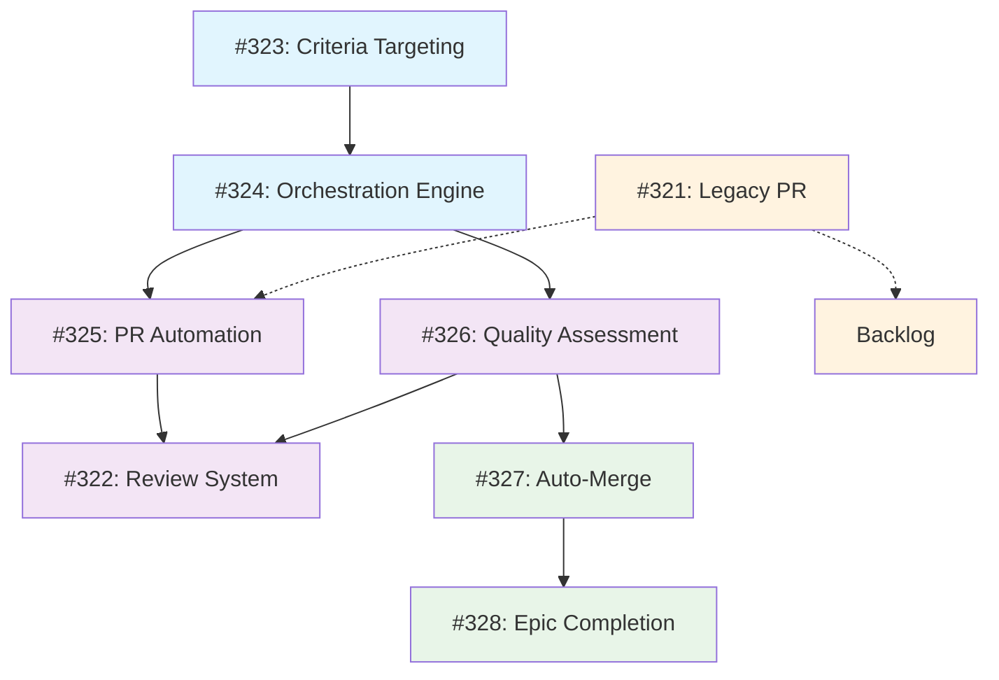

# GitHub Issues Deep Dive Review Report
*Generated: 2025-08-04*

## Executive Summary

✅ **All 9 GitHub issues are VALID and well-structured**  
✅ **Epic structure is comprehensive and properly organized**  
✅ **4 milestones created with logical phased approach**  
✅ **Clear dependency chain established**  
⚠️ **1 issue superseded by more comprehensive alternative**

## Issue Analysis

### 📊 Issue Distribution by Milestone

| Milestone | Issues | Due Date | Status |
|-----------|--------|----------|---------|
| **Phase 1: Core Workflow Foundation** | 2 issues | Aug 31, 2025 | ✅ Ready |
| **Phase 2: PR & Quality Automation** | 3 issues | Sep 30, 2025 | ✅ Ready |
| **Phase 3: Auto-Merge & Epic Completion** | 2 issues | Oct 31, 2025 | ✅ Ready |
| **Backlog** | 1 issue | No due date | ⚠️ Superseded |

### 🔍 Detailed Issue Validation

#### ✅ EPIC ISSUE: #328 - Modern Autonomous Workflow System
- **Type**: Epic (parent issue)
- **Priority**: High
- **Milestone**: Phase 3: Auto-Merge & Epic Completion
- **Status**: **VALID** - Comprehensive epic with clear goals
- **Quality**: Excellent structure with architecture diagrams, success metrics, and definition of done
- **Dependencies**: References all child issues (#323-327)

#### ✅ PHASE 1 ISSUES (Foundation)

**#323 - Enhance auto:run with criteria targeting**
- **Type**: Feature enhancement
- **Priority**: High  
- **Milestone**: Phase 1: Core Workflow Foundation
- **Status**: **VALID** - Clear acceptance criteria and technical spec
- **Dependencies**: None (foundation issue)

**#324 - Build modern autonomous TDD orchestration engine**  
- **Type**: Core feature
- **Priority**: High
- **Milestone**: Phase 1: Core Workflow Foundation
- **Status**: **VALID** - Comprehensive orchestration requirements
- **Dependencies**: Issue #323 (criteria targeting)

#### ✅ PHASE 2 ISSUES (Automation)

**#325 - Build intelligent PR automation**
- **Type**: Feature
- **Priority**: High
- **Milestone**: Phase 2: PR & Quality Automation  
- **Status**: **VALID** - Modern PR automation with AI enhancements
- **Dependencies**: Issue #324 (workflow completion detection)

**#326 - Build modern quality assessment**
- **Type**: Feature
- **Priority**: High
- **Milestone**: Phase 2: PR & Quality Automation
- **Status**: **VALID** - Extensible quality system with plugin architecture
- **Dependencies**: Issue #325 (PR creation triggers)

**#322 - Implement automatic review system**
- **Type**: Feature
- **Priority**: High
- **Milestone**: Phase 2: PR & Quality Automation
- **Status**: **VALID** - Legacy feature restoration with quality scoring
- **Dependencies**: Issue #321/#325 (PR creation)

#### ✅ PHASE 3 ISSUES (Completion)

**#327 - Build intelligent auto-merge system**
- **Type**: Feature
- **Priority**: High
- **Milestone**: Phase 3: Auto-Merge & Epic Completion
- **Status**: **VALID** - Enterprise-grade merge automation
- **Dependencies**: Issue #326 (quality assessment inputs)

#### ⚠️ BACKLOG ISSUES

**#321 - Add automatic PR creation**
- **Type**: Feature (superseded)
- **Priority**: High → Backlog
- **Milestone**: Backlog
- **Status**: **VALID but SUPERSEDED** by Issue #325
- **Action**: Comment added explaining supersession

## Milestone Structure Analysis

### 🚀 Phase 1: Core Workflow Foundation
**Timeline**: Aug 31, 2025 (Sprint 1)  
**Focus**: Establish autonomous workflow capabilities  
**Issues**: #323, #324  
**Risk Level**: Low - Foundation components with clear requirements

### 🔧 Phase 2: PR & Quality Automation  
**Timeline**: Sep 30, 2025 (Sprint 2)  
**Focus**: Complete workflow automation with quality gates  
**Issues**: #325, #326, #322  
**Risk Level**: Medium - AI integration and quality system complexity

### 🏁 Phase 3: Auto-Merge & Epic Completion
**Timeline**: Oct 31, 2025 (Sprint 3)  
**Focus**: Complete autonomous workflow with safety controls  
**Issues**: #327, #328  
**Risk Level**: Medium - Enterprise-grade safety requirements

### 📋 Backlog
**Timeline**: No due date  
**Focus**: Future enhancements and superseded issues  
**Issues**: #321  
**Risk Level**: N/A - Reference only

## Dependency Chain Analysis

## Quality Assessment

### ✅ Strengths
- **Comprehensive Coverage**: All aspects of autonomous workflow addressed
- **Clear Dependencies**: Logical progression from foundation to completion  
- **Modern Architecture**: TypeScript-based with AI integration
- **Enterprise Features**: Safety controls, audit trails, compliance
- **Detailed Requirements**: Each issue has clear acceptance criteria
- **Consistent Labeling**: Proper use of priority, area, and epic labels

### ⚠️ Areas for Monitoring
- **AI Integration Complexity**: Issues #325, #326 involve LLM APIs
- **Enterprise Requirements**: Issue #327 has complex policy engine needs
- **Timeline Pressure**: 3-month delivery window is ambitious
- **Testing Requirements**: Comprehensive test coverage needed across all components

### 🎯 Recommendations

1. **Prioritize Phase 1 Completion**: Focus resources on #323 and #324 first
2. **AI Provider Selection**: Choose consistent AI provider (Claude/OpenAI) early
3. **Plugin Architecture**: Design extensible systems for future enhancements  
4. **Safety First**: Implement comprehensive error handling and rollback capabilities
5. **Documentation**: Maintain API documentation throughout development
6. **Performance Monitoring**: Establish benchmarks and monitoring early

## Risk Analysis

### 🟢 Low Risk
- Issue #323: Criteria targeting (well-defined, isolated scope)
- Issue #322: Review system (restoration of existing functionality)

### 🟡 Medium Risk  
- Issue #324: Orchestration engine (complex state management)
- Issue #325: PR automation (AI integration dependency)
- Issue #326: Quality assessment (multi-framework support)

### 🟠 Medium-High Risk
- Issue #327: Auto-merge system (enterprise safety requirements)
- Issue #328: Epic completion (depends on all other issues)

## Success Criteria

### Technical Milestones
- [ ] **Phase 1**: Core workflow execution without manual intervention
- [ ] **Phase 2**: Automated PR creation with quality assessment  
- [ ] **Phase 3**: Complete autonomous workflow with merge automation

### Quality Gates
- [ ] **100% test coverage** for all new TypeScript components
- [ ] **Performance benchmarks** <30s overhead for autonomous execution
- [ ] **Security review** for AI integration and GitHub API usage
- [ ] **Documentation completeness** for all APIs and configurations

### Business Impact
- [ ] **Developer efficiency** improved through autonomous workflows
- [ ] **Code quality** maintained through automated assessment
- [ ] **Enterprise adoption** enabled through governance features

## Conclusion

The GitHub issues represent a **well-structured, comprehensive modernization effort** that will transform WorkFlo from a legacy bash-based system to a modern TypeScript autonomous workflow platform.

**Key Takeaways**:
- All issues are valid and properly scoped
- Milestone structure provides logical delivery phases
- Dependency chain ensures proper sequencing
- Epic represents significant value for autonomous development workflows

**Next Steps**:
1. Begin Phase 1 development with Issue #323
2. Establish AI provider and API key configuration  
3. Set up comprehensive test infrastructure
4. Create detailed technical design documents for each component

---

*This report provides a comprehensive analysis of all GitHub issues and milestone assignments for the WorkFlo Modern Autonomous Workflow System epic.*