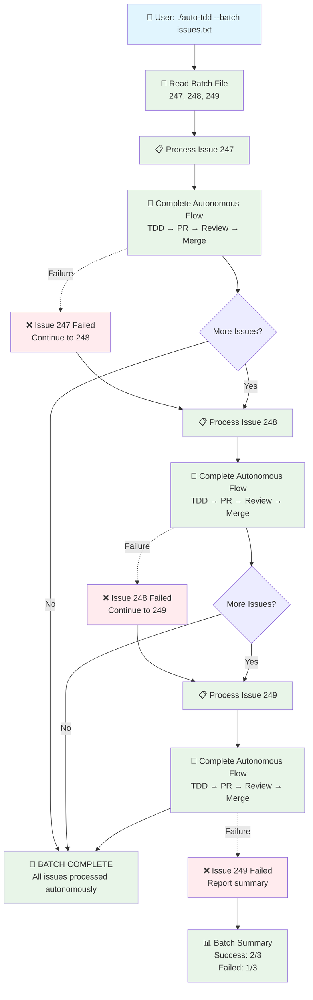

# Auto-TDD Autonomous Workflow Diagram

## Complete End-to-End Autonomous Flow
### 🔵 Human | 🟣 AI | 🟢 System | 🟡 Programmatic

```mermaid
graph TD
    A[👤 HUMAN: ./auto-tdd 247<br/>Single command entry point] --> B{🟢 SYSTEM: TDD Session Active?}
    
    B -->|No| C[🟢 SYSTEM: Initialize TDD Session<br/>./tdd start 247]
    B -->|Yes| D[🟢 SYSTEM: Load Current State]
    
    C --> D
    D --> E[🟢 SYSTEM: Process Criteria 1 of N]
    
    %% TDD Cycle Block
    E --> F[🔄 AUTONOMOUS TDD CYCLE]
    
    subgraph TDD ["🔄 Autonomous TDD Cycle - AI Work, System Orchestration"]
        F1[🟣 AI: RED Phase<br/>Writes failing tests<br/>🟢 System: ./tdd red]
        F2[🟣 AI: GREEN Phase<br/>Implements solution<br/>🟢 System: ./tdd green]
        F3[🟣 AI: REFACTOR Phase<br/>Improves code quality<br/>🟢 System: ./tdd refactor]
        F4[🟣 AI: COVER Phase<br/>Adds comprehensive tests<br/>🟢 System: ./tdd cover]
        F5[🟣 AI: DOCUMENT Phase<br/>Documents learnings<br/>🟢 System: ./tdd document]
        F6[🟢 SYSTEM: NEXT Phase<br/>Moves to next criteria<br/>./tdd next]
        
        F1 --> F2
        F2 --> F3
        F3 --> F4
        F4 --> F5
        F5 --> F6
    end
    
    F --> F1
    F6 --> G{🟡 PROGRAMMATIC: More Criteria?<br/>Auto-decision logic}
    
    G -->|Yes| H[🟡 PROGRAMMATIC: Next Criteria N+1<br/>Auto-increment counter]
    H --> F
    
    G -->|No| I[🟡 PROGRAMMATIC: All Criteria Complete<br/>Auto-trigger PR creation]
    
    %% PR Creation and Review Block
    I --> J[🟢 SYSTEM: Auto-Create PR<br/>Title: Auto-TDD Complete #247<br/>Body: Summary + /review trigger]
    
    J --> K[🔍 AUTOMATIC REVIEW PHASE]
    
    subgraph REVIEW ["🔍 Autonomous Review Phase - Mixed AI/System/Programmatic"]
        K1[🟢 SYSTEM: Run All Tests<br/>npm test / ./run-tests]
        K2[🟢 SYSTEM: Mutation Testing<br/>Stryker analysis]
        K3[🟡 PROGRAMMATIC: Code Coverage<br/>Auto-extract coverage %]
        K4[🟢 SYSTEM: Code Quality<br/>Linting, shellcheck]
        K5[🟡 PROGRAMMATIC: Issue Completion<br/>Auto-check acceptance criteria]
        K6[🟣 AI: Code Review<br/>review-bot analysis]
    end
    
    K --> K1
    K1 --> K2
    K2 --> K3
    K3 --> K4
    K4 --> K5
    K5 --> K6
    
    %% Scoring and Decision Block
    K6 --> L[🟡 PROGRAMMATIC: Calculate Score<br/>Tests: 30pts | Mutation: 25pts<br/>Coverage: 20pts | Completion: 25pts<br/>Auto-weighted scoring algorithm]
    
    L --> M{🟡 PROGRAMMATIC: Score ≥ 90%?<br/>Auto-decision threshold}
    
    M -->|Yes| N[🟡 PROGRAMMATIC: AUTO-MERGE<br/>✅ Auto-comment: Score 95%<br/>🔀 Auto gh pr merge --squash]
    M -->|No| O[🟡 PROGRAMMATIC: MANUAL REVIEW<br/>💬 Auto-comment: Score 75%<br/>🔔 Auto-notify humans]
    
    N --> P[🟡 PROGRAMMATIC: Check More Criteria<br/>Auto-decision on next steps]
    
    P --> Q{🟡 PROGRAMMATIC: More Criteria?<br/>CRITERIA < TOTAL}
    Q -->|Yes| R[🟡 PROGRAMMATIC: ./tdd next<br/>Move to next criteria automatically]
    Q -->|No| S[✅ COMPLETE SUCCESS<br/>🟡 PROGRAMMATIC: Issue fully automated<br/>from start to merge]
    
    R --> T[🔄 Return to TDD Cycle<br/>Process next criteria]
    T --> F
    
    O --> MANUAL1[👤 HUMAN: Manual Review Process<br/>Human reviews and decides]
    MANUAL1 --> MANUAL2[👤 HUMAN: Manual Merge<br/>or rejection decision]
    
    %% Error Handling - Programmatic Recovery
    F1 -.->|Timeout/Failure| RETRY1[🟡 PROGRAMMATIC: Auto-Retry<br/>Attempt 1-3, exponential backoff]
    F2 -.->|Timeout/Failure| RETRY2[🟡 PROGRAMMATIC: Auto-Retry<br/>Attempt 1-3, exponential backoff]
    F3 -.->|Timeout/Failure| RETRY3[🟡 PROGRAMMATIC: Auto-Retry<br/>Attempt 1-3, exponential backoff]
    F4 -.->|Timeout/Failure| RETRY4[🟡 PROGRAMMATIC: Auto-Retry<br/>Attempt 1-3, exponential backoff]
    F5 -.->|Timeout/Failure| RETRY5[🟡 PROGRAMMATIC: Auto-Retry<br/>Attempt 1-3, exponential backoff]
    
    RETRY1 -.->|Success| F2
    RETRY2 -.->|Success| F3
    RETRY3 -.->|Success| F4
    RETRY4 -.->|Success| F5
    RETRY5 -.->|Success| F6
    
    RETRY1 -.->|All Retries Failed| ERROR[❌ FAILURE<br/>🟡 PROGRAMMATIC: Auto-log error<br/>🔔 Auto-notify humans<br/>👤 HUMAN: Intervention required]
    RETRY2 -.->|All Retries Failed| ERROR
    RETRY3 -.->|All Retries Failed| ERROR
    RETRY4 -.->|All Retries Failed| ERROR
    RETRY5 -.->|All Retries Failed| ERROR
    
    %% Styling
    classDef humanAction fill:#e1f5fe
    classDef aiWork fill:#f3e5f5
    classDef systemWork fill:#e8f5e8
    classDef programmaticWork fill:#fff8e1
    classDef success fill:#e8f5e8
    classDef failure fill:#ffebee
    
    class A,Q,R humanAction
    class F1,F2,F3,F4,F5,K6 aiWork
    class B,C,D,J,K1,K2,K4 systemWork
    class G,H,I,K3,K5,L,M,N,O,RETRY1,RETRY2,RETRY3,RETRY4,RETRY5 programmaticWork
    class P,N success
    class ERROR,O failure
```

## Batch Processing Flow



## Stage Responsibilities

### 👤 Human Stages (Blue)
- **Initial Trigger**: `./auto-tdd 247` - Single command to start entire process
- **Manual Review**: When auto-merge score < 90%, human reviews and decides
- **Manual Merge**: Final human decision on controversial changes
- **Error Resolution**: When all automated retries fail, human intervention required

### 🟣 AI Stages (Purple) 
- **RED Phase**: Analyzes acceptance criteria and writes failing tests
- **GREEN Phase**: Implements minimal solution to make tests pass
- **REFACTOR Phase**: Improves code quality while keeping tests green
- **COVER Phase**: Adds comprehensive test coverage and edge cases
- **DOCUMENT Phase**: Documents learnings and patterns in CLAUDE.md
- **Code Review**: AI-powered analysis of changes for quality assessment

### 🟢 System Stages (Green)
- **Session Management**: Initialize TDD, load/save state
- **Test Execution**: Run test suites, mutation testing, linting
- **Git Operations**: Create PRs, handle commits, manage branches
- **Tool Integration**: Execute npm, bats, shellcheck, gh commands

### 🟡 Programmatic Stages (Yellow)
- **Flow Control**: Auto-decision on more criteria, completion triggers
- **Scoring Algorithm**: Calculate quality scores from multiple metrics
- **Auto-merge Logic**: Threshold-based merge decisions (≥90%)
- **Error Recovery**: Retry logic with exponential backoff
- **Monitoring**: Auto-logging, notifications, status tracking
- **Batch Processing**: Multi-issue orchestration and progress management

## Corrected Workflow Sequence

**Per-Criteria Flow**: `RED → GREEN → REFACTOR → COVER → DOCUMENT → PR → REVIEW → MERGE → NEXT`

**Key Point**: The NEXT phase (moving to next criteria) happens **after** the current criteria is merged, not before PR creation. This ensures each criteria is completely finished before starting the next one.

## Key Autonomous Features

### 🤖 Zero Human Intervention
- **Single Entry Point**: `./auto-tdd 247`
- **Complete Automation**: Issue start → PR merge
- **Error Recovery**: Automatic retries with fallback

### 🧠 AI + System Collaboration
- **AI Handles**: Creative work (coding, testing, documenting)
- **System Handles**: Mechanical flow (orchestration, validation, merging)
- **Clean Separation**: AI focuses on quality, system manages workflow

### 🎯 Quality Gates
- **Scoring System**: 100-point quality assessment
- **Auto-merge Threshold**: 90%+ automatically merges
- **Manual Review**: <90% requires human review
- **Transparent**: All decisions posted as PR comments

### 🔄 Robust Error Handling
- **Phase Retries**: Up to 3 attempts per failed phase
- **Timeout Protection**: 600s timeout per phase
- **Graceful Degradation**: Continues processing other issues
- **State Recovery**: Resumes from interruption point

### 📊 Batch Processing
- **Multiple Issues**: Process entire backlog overnight
- **Progress Tracking**: Real-time status updates
- **Summary Reports**: Success/failure statistics
- **Parallel Ready**: Future enhancement for concurrent processing

This workflow completely **replaces human orchestration** while maintaining high quality through automated review and intelligent merge decisions.