# Multi-AC Auto-TDD Workflow: Clean & Practical

## Complete Flow with Feature Branch Strategy
*Single entry point → Sequential AC processing → Feature branch integration → Final scope review*

```mermaid
graph TB
    %% Title and Legend
    subgraph LEGEND [" 🎯 LEGEND "]
        L1[👤 Human Action]
        L2[🟣 AI/Claude Work]
        L3[🟢 System/Automated]
        L4[🟡 Script/Program Logic]
        L5[🔴 Rework Required]
    end
    
    %% Main Flow Start
    START[👤 HUMAN<br/>Runs: flo-cli auto 247<br/>Issue: User Management System<br/>3 acceptance criteria] 
    
    START --> OVERVIEW{🎯 WORKFLOW OVERVIEW<br/>Feature branch strategy:<br/>AC branches → Feature branch<br/>Final PR → Main}
    
    OVERVIEW --> INIT[🟢 SYSTEM<br/>Create feature branch<br/>feature/issue-247-user-management-system]
    
    INIT --> AC1_START[🟡 PROGRAMMATIC<br/>Start AC 1 of 3<br/>Branch: feature/issue-247-ac1-authentication]
    
    AC1_START --> AC1_FLOW[🔄 AC1: TDD CYCLE]
    
    subgraph AC1 [" 📋 ACCEPTANCE CRITERIA 1: Authentication "]
        AC1_TDD[🟣 AI: Write failing test<br/>↓<br/>🟣 AI: Make test pass<br/>↓<br/>🟣 AI: Refactor code<br/>↓<br/>🟣 AI: Add more tests<br/>↓<br/>🟣 AI: Document]
        
        AC1_CHECKS{🟢 SYSTEM<br/>All tests passing?<br/>Quality checks OK?}
        
        AC1_TDD --> AC1_CHECKS
        AC1_CHECKS -->|❌ No| AC1_REWORK[🔴 REWORK<br/>Fix issues<br/>Max 3 retries]
        AC1_REWORK --> AC1_TDD
        AC1_CHECKS -->|✅ Yes| AC1_PR[🟢 Create PR<br/>AC1 → Feature branch<br/>Target: feature/issue-247-user-management-system]
    end
    
    AC1_FLOW --> AC1_TDD
    
    %% Review Process
    AC1_PR --> REVIEW1{🔍 AUTO REVIEW<br/>Score ≥ 90%?}
    
    REVIEW1 -->|✅ Yes| AUTO_MERGE1[🟡 Auto-squash merge<br/>AC1 → Feature branch]
    REVIEW1 -->|❌ No| MANUAL1[👤 Human review<br/>required]
    
    MANUAL1 --> HUMAN_DECIDES1{👤 Decision?}
    HUMAN_DECIDES1 -->|Approve| MERGE1[✅ Squash merge<br/>AC1 → Feature branch]
    HUMAN_DECIDES1 -->|Changes| AC1_REWORK
    
    AUTO_MERGE1 --> AC1_CLEANUP[🟢 SYSTEM<br/>Delete AC1 branch<br/>feature/issue-247-ac1-authentication]
    MERGE1 --> AC1_CLEANUP
    
    AC1_CLEANUP --> AC1_DONE[✅ AC1 Complete<br/>Merged to feature branch]
    
    %% AC2 Simplified (same pattern)
    AC1_DONE --> AC2_START[🟡 PROGRAMMATIC<br/>Start AC 2 of 3<br/>Branch off feature branch:<br/>feature/issue-247-ac2-authorization]
    
    subgraph AC2 [" 📋 ACCEPTANCE CRITERIA 2: Authorization "]
        AC2_TDD[🟣 AI: Same TDD process<br/>RED → GREEN → REFACTOR<br/>→ COVER → DOCUMENT<br/>Builds on AC1 work]
        AC2_TDD --> AC2_PR[🟢 Create PR<br/>AC2 → Feature branch<br/>Target: feature/issue-247-user-management-system]
    end
    
    AC2_START --> AC2_TDD
    AC2_PR --> AC2_MERGE[🟡 Auto-squash merge<br/>AC2 → Feature branch]
    AC2_MERGE --> AC2_CLEANUP[🟢 Delete AC2 branch]
    AC2_CLEANUP --> AC2_DONE[✅ AC2 Complete<br/>Merged to feature branch]
    
    %% AC3 Simplified (same pattern)
    AC2_DONE --> AC3_START[🟡 PROGRAMMATIC<br/>Start AC 3 of 3<br/>Branch off feature branch:<br/>feature/issue-247-ac3-user-profiles]
    
    subgraph AC3 [" 📋 ACCEPTANCE CRITERIA 3: User Profiles "]
        AC3_TDD[🟣 AI: Same TDD process<br/>RED → GREEN → REFACTOR<br/>→ COVER → DOCUMENT<br/>Builds on AC1+AC2 work]
        AC3_TDD --> AC3_PR[🟢 Create PR<br/>AC3 → Feature branch<br/>Target: feature/issue-247-user-management-system]
    end
    
    AC3_START --> AC3_TDD
    AC3_PR --> AC3_MERGE[🟡 Auto-squash merge<br/>AC3 → Feature branch]
    AC3_MERGE --> AC3_CLEANUP[🟢 Delete AC3 branch]
    AC3_CLEANUP --> AC3_DONE[✅ AC3 Complete<br/>All ACs merged to feature branch]
    
    %% Final Feature Review
    AC3_DONE --> FINAL_REVIEW[🔍 FINAL FEATURE REVIEW<br/>🟣 AI: Comprehensive scope analysis]
    
    FINAL_REVIEW --> SCOPE_CHECK{🟡 PROGRAMMATIC<br/>Scope Analysis Results}
    
    SCOPE_CHECK -->|Issues Found| SCOPE_TASKS[🟢 SYSTEM<br/>Create new issues/ACs:<br/>• Out-of-scope features found<br/>• Missing requirements discovered<br/>• Extra scope removal needed]
    
    SCOPE_CHECK -->|Clean| FINAL_PR[🟢 SYSTEM<br/>Create Final PR<br/>Feature branch → Main]
    
    SCOPE_TASKS --> FINAL_PR
    
    FINAL_PR --> FEATURE_COMPLETE[🎉 FEATURE COMPLETE<br/>Ready for main merge]
    
    %% Error Handling
    AC1_REWORK -.->|Max retries<br/>exceeded| STUCK[❌ HUMAN INTERVENTION<br/>🔔 Notification sent<br/>Manual fix required]
    
    %% Key Points Box
    subgraph KEY_POINTS [" 📌 KEY POINTS "]
        K1[Each AC is independent]
        K2[Auto-merge if quality ≥ 90%]
        K3[3 retry attempts per phase]
        K4[Next AC starts automatically]
        K5[Human notified if stuck]
    end
    
    %% Styling
    classDef human fill:#e3f2fd,stroke:#1976d2,stroke-width:2px
    classDef ai fill:#f3e5f5,stroke:#7b1fa2,stroke-width:2px
    classDef system fill:#e8f5e9,stroke:#388e3c,stroke-width:2px
    classDef program fill:#fff8e1,stroke:#f57c00,stroke-width:2px
    classDef rework fill:#ffebee,stroke:#d32f2f,stroke-width:2px
    classDef success fill:#c8e6c9,stroke:#388e3c,stroke-width:3px
    classDef failure fill:#ffcdd2,stroke:#d32f2f,stroke-width:3px
    classDef overview fill:#fff,stroke:#333,stroke-width:2px,stroke-dasharray: 5 5
    
    class START,MANUAL1,HUMAN_DECIDES1 human
    class AC1_TDD,AC2_TDD,AC3_TDD ai
    class INIT,AC1_CHECKS,AC1_PR,AC2_PR,AC3_PR,REVIEW1 system
    class AUTO_MERGE1,AC1_FLOW,AC2_FLOW,AC3_FLOW program
    class AC1_REWORK,STUCK rework
    class AC1_DONE,AC2_DONE,AC3_DONE,COMPLETE,MERGE1 success
    class STUCK failure
    class OVERVIEW,KEY_POINTS,LEGEND overview
```



## Workflow Details

### 🚀 **Single Entry Point**
```bash
flo-cli auto 247  # Issue with 3 acceptance criteria

# Alternative subcommands:
flo-cli auto start 247
flo-cli auto status  
flo-cli auto batch issues.txt
```

### 🏗️ **Feature Branch Strategy**
Hierarchical branching with incremental development:

#### **Main Feature Branch**
- `feature/issue-247-user-management-system` (persists throughout)

#### **AC Branches** (temporary, squash-merged)
- `feature/issue-247-ac1-authentication` → squash merge → delete
- `feature/issue-247-ac2-authorization` → squash merge → delete  
- `feature/issue-247-ac3-user-profiles` → squash merge → delete

#### **Final Integration**
- `feature/issue-247-user-management-system` → regular merge → main

**Benefits:**
- ✅ **Incremental building**: Each AC builds on previous work
- ✅ **Clean history**: Squashed AC commits, preserved feature history
- ✅ **Single integration**: One final PR to main instead of 3
- ✅ **Better testing**: Each AC tests against cumulative work

### 🔄 **Sequential AC Processing**
Each acceptance criteria is processed completely before starting the next:

1. **AC1**: Complete TDD cycle → PR → Review → Merge → ✅ Done
2. **AC2**: Complete TDD cycle → PR → Review → Merge → ✅ Done  
3. **AC3**: Complete TDD cycle → PR → Review → Merge → ✅ Done

### 🎯 **Per-AC TDD Cycle**
Each AC goes through the complete cycle:
- 🟣 **RED**: AI writes failing tests
- 🟣 **GREEN**: AI implements solution
- 🟣 **REFACTOR**: AI improves code quality
- 🟣 **COVER**: AI adds comprehensive tests
- 🟣 **DOCUMENT**: AI documents learnings

### ✅ **Quality Gates**
- 🟢 **System Checks**: All tests pass, quality metrics met
- 🔍 **Auto Review**: Scoring system (tests, mutation, coverage, completion)
- 🟡 **Auto-merge**: Score ≥ 90% → automatic merge
- 👤 **Manual Review**: Score < 90% → human review required

### 🔴 **Rework Handling**
- **Max 3 retries** per TDD cycle
- **Intelligent routing**: System determines which phase needs rework
- **Human notification**: When max retries exceeded
- **Graceful degradation**: Manual intervention when automation fails

### 📊 **Enhanced State Management**
```bash
# Track AC progress with descriptive context
ISSUE=247
TOTAL_ACS=3
CURRENT_AC=1
AC_DESCRIPTIONS=("user-authentication-system" "payment-processing-integration" "admin-dashboard-ui")
CURRENT_PHASE=GREEN
RETRY_COUNT=2
MAX_RETRIES=3
BRANCH_NAME="feature/issue-247-ac1-user-authentication-system"
```

### 🔧 **AC Text Parsing Logic**
```bash
# Extract key terms from AC text for branch naming
parse_ac_for_branch() {
    local ac_text="$1"
    local ac_number="$2"
    
    # Extract key nouns and actions, slugify
    local description=$(echo "$ac_text" | 
        grep -oE '[A-Za-z]+' | 
        head -4 | 
        tr '[:upper:]' '[:lower:]' | 
        tr '\n' '-' | 
        sed 's/-$//')
    
    echo "feature/issue-${ISSUE}-ac${ac_number}-${description}"
}
```

### 🔍 **Final Feature Review & Scope Management**
After all ACs are complete, comprehensive scope analysis:

#### **Scope Analysis Tasks**
1. **Out-of-scope detection**: Features implemented beyond original requirements
2. **Missing requirements**: Requirements discovered during development
3. **Extra scope removal**: ACs created to remove unneeded features

#### **Automated Issue Creation**
```typescript
// Example scope analysis results
const scopeAnalysis = {
  outOfScope: [
    "Password reset functionality not in original spec",
    "Advanced user role permissions beyond basic auth"
  ],
  missing: [
    "Email verification for new user accounts",
    "Audit logging for user actions"
  ],
  extraToRemove: [
    "Development debug endpoints exposed in production"
  ]
};

// Auto-create follow-up issues
scopeAnalysis.outOfScope.forEach(item => 
  createIssue(`Out-of-scope: ${item}`, "enhancement"));
scopeAnalysis.missing.forEach(item => 
  createIssue(`Missing requirement: ${item}`, "bug"));
scopeAnalysis.extraToRemove.forEach(item => 
  addAC(currentIssue, `Remove: ${item}`));
```

### 🎯 **Merge Strategy**
- **AC branches**: `git merge --squash` (clean single commit per AC)
- **Feature branch**: `git merge` (preserve AC history in feature)
- **Main integration**: Regular merge (preserve feature development history)

### 🎉 **Success Criteria**
Feature is complete when:
1. ✅ All original ACs implemented and merged to feature branch
2. ✅ Final scope review completed with follow-up issues created
3. ✅ Extra scope removal ACs completed (if any)
4. ✅ Feature branch successfully merged to main
5. ✅ All tests passing across entire codebase
6. ✅ Quality gates met for final feature integration

This enhanced flow ensures **autonomous operation**, **scope discipline**, and **comprehensive feature delivery** with proper **follow-up task management**.