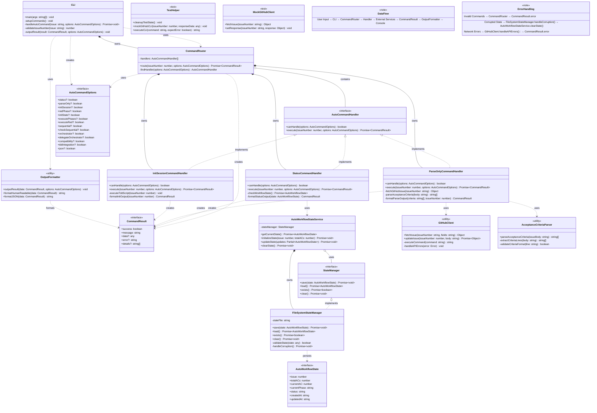
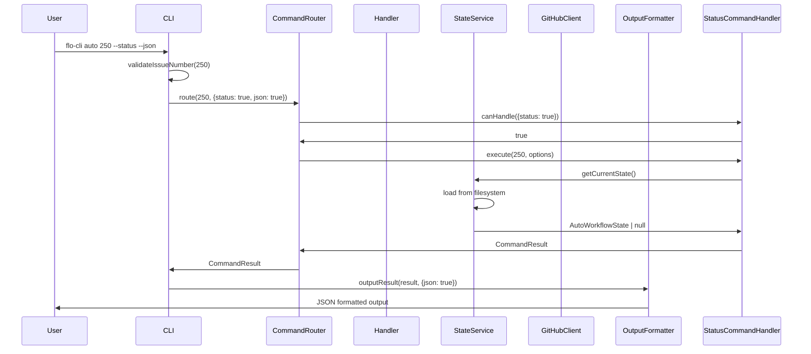
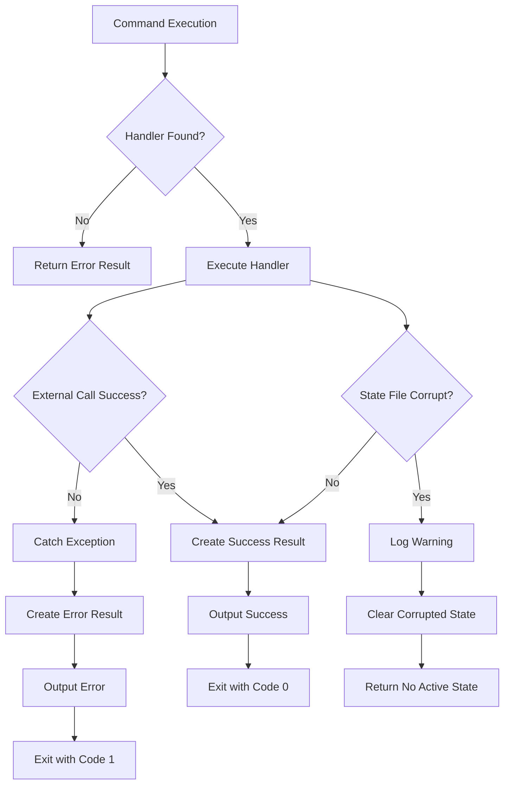

# WorkFlo Auto-CLI Architecture Class Diagram

## Key Architecture Patterns

### 1. **Command Pattern**
- `AutoCommandHandler` interface defines command contract
- Concrete handlers (`StatusCommandHandler`, etc.) implement specific logic
- `CommandRouter` acts as invoker, dispatching to appropriate handler

### 2. **Strategy Pattern**
- `StateManager` interface allows different storage strategies
- `FileSystemStateManager` implements file-based persistence
- Easy to add database or cloud storage implementations

### 3. **Chain of Responsibility**
- `CommandRouter` iterates through handlers until one can handle the request
- Handlers use `canHandle()` to determine if they should process the command

### 4. **Template Method**
- Common command execution flow defined in `AutoCommandHandler`
- Concrete handlers implement specific steps while following the template

### 5. **Dependency Injection**
- Handlers receive dependencies (state service, GitHub client) rather than creating them
- Enables easy testing and configuration

## Data Flow Diagram

## Error Handling Flow

This architecture provides:

🏗️ **Scalability**: Easy to add new commands without modifying existing code
🔧 **Maintainability**: Clear separation of concerns and single responsibility
🧪 **Testability**: Each component can be unit tested independently  
🛡️ **Reliability**: Comprehensive error handling and state corruption recovery
📊 **Flexibility**: Dual output modes (human/JSON) for different use cases
🚀 **Extensibility**: Plugin-like architecture for future enhancements