# 🎯 GitHub Project Board Integration

Strict integration between your development workflow and GitHub project board for complete issue lifecycle management.

## 🔗 Board Configuration

**Primary Project Board**: [Anchor Board](https://github.com/users/DanMarshall909/projects/2)
- **Project ID**: `PVT_kwHOAjuTnM4A91Jy`
- **Repository**: `DanMarshall909/Anchor`
- **Status Columns**: Todo → In Progress → Done

## 🚀 Quick Start

### Session Workflow
```bash
# 1. Start work session (shows available issues)
./scripts/enhanced-start-work.sh

# 2. Develop using TDD scripts (auto-updates board on completion)
./scripts/tdd-phase-4-commit.sh feature-name "description"

# 3. Manual board operations
./scripts/gh-board-sync.sh show              # View board status
./scripts/gh-board-sync.sh complete 73       # Complete issue #73
```

## 📋 Core Scripts

### Issue & Board Management

| Script | Purpose | Board Integration |
|--------|---------|------------------|
| `enhanced-start-work.sh` | Interactive issue selection & work start | ✅ Moves to "In Progress" |
| `gh-board-sync.sh` | Direct board operations | ✅ Full CRUD operations |
| `tdd-phase-4-commit.sh` | Enhanced TDD workflow | ✅ Completion detection |

## 🔄 Workflow Diagram


## 📊 Board Operations

### View Board Status
```bash
./scripts/gh-board-sync.sh show
```
**Output:**
```
📋 IN PROGRESS:
  - #73: Bug: Backend Database Configuration and Registration API Errors
  - #65: Session Timer Phase 2: Zustand Store

📝 TODO:
  - #74: Feature Flag Infrastructure
  - #75: Privacy Infrastructure
  - (+ 13 more issues)
```

### Direct Board Management
```bash
# Start working on an issue
./scripts/gh-board-sync.sh start 73

# Update issue status manually
./scripts/gh-board-sync.sh status 73 in-progress

# Complete and close issue
./scripts/gh-board-sync.sh complete 73

# Add existing issue to board
./scripts/gh-board-sync.sh add 74
```

## 🔄 Automated Workflow Details

### 1. Session Initialization
**Script:** `enhanced-start-work.sh`


**Automatically:**
- ✅ Checks existing progress in PROGRESS.md
- ✅ Lists available GitHub issues with labels
- ✅ Updates project board to "In Progress"
- ✅ Starts progress tracking
- ✅ Updates PROGRESS.md with current issue

### 2. TDD Development Cycle
**Scripts:** `tdd-phase-4-commit.sh`, `tdd-hooks-commit.sh`

```mermaid
flowchart LR
    A[Start TDD] --> B[Write Failing Test]
    B --> C[Run Tests: RED]
    C --> D[Write Minimal Code]
    D --> E[Run Tests: GREEN]
    E --> F[Refactor Code]
    F --> G[Run Tests: GREEN]
    G --> H[Coverage Check ≥95%]
    H --> I[Create Quality Commit]
    I --> J{Issue Complete?}
    J -->|No| A
    J -->|Yes| K[Update Board: Done]
    K --> L[Close GitHub Issue]
    
    style C fill:#ffebee
    style E fill:#e8f5e8
    style G fill:#e8f5e8
    style H fill:#fff3e0
    style K fill:#e8f5e8
```



**Integration Points:**
- ✅ Tracks current issue from PROGRESS.md
- ✅ Enforces 95% test coverage requirement
- ✅ Creates standardized commit messages
- ✅ Prompts for issue completion
- ✅ Auto-updates board and closes issues

### 3. Issue Completion Flow
**Script:** `gh-board-sync.sh complete`


## 📈 Quality Integration

### Coverage & Board Synchronization
Every TDD commit includes:
- **Test count tracking**
- **Coverage percentages** (Statement, Branch, Function)
- **Quality metrics** in commit messages
- **Board status verification**

### Example Commit Message
```
feat(components)(SessionTimer): implement timer with pause/resume

🧪 TDD Phase 4 implementation
- Implement SessionTimer component with TDD approach
- Create comprehensive test suite with 12 tests
- Achieve 98% statement coverage
- Achieve 95% branch coverage  
- Achieve 100% function coverage
- Red-Green-Refactor-Cover-Commit cycle completed

🤖 Generated with [Claude Code](https://claude.ai/code)

Co-Authored-By: Claude <noreply@anthropic.com>
```

## 🔧 Advanced Operations

### Task Continuation Support

The workflow fully supports continuing previous work:

**Automatic Detection:**
```bash
# Always start with this - it detects existing work
./scripts/enhanced-start-work.sh
```

**What happens when you have existing work:**
1. ✅ Reads current issue from PROGRESS.md
2. ✅ Shows issue details and current status  
3. ✅ Asks: "Continue current work? (y/n)"
4. ✅ If yes: maintains current board status and continues
5. ✅ If no: offers new issue selection

**Manual Progress Check:**
```bash
# Check what you were working on
cat PROGRESS.md

# View board status
./scripts/gh-board-sync.sh show

# Switch to different issue manually
./scripts/gh-board-sync.sh start 75
```

**Session Continuity Features:**
- ✅ **PROGRESS.md tracking** - Always knows current issue
- ✅ **Board state preservation** - Issue stays "In Progress"
- ✅ **Context restoration** - Shows issue details when continuing
- ✅ **Seamless resumption** - No board updates needed when continuing

### Batch Operations
```bash
# View all board status
./scripts/gh-board-sync.sh show

# Add multiple issues to board
for issue in 74 75 76; do
  ./scripts/gh-board-sync.sh add $issue
done
```

## 🎯 Best Practices

### Workflow Discipline
1. **Always start** with `enhanced-start-work.sh`
2. **Use TDD scripts** for automatic board integration
3. **Complete issues promptly** to maintain board accuracy
4. **Check board status** regularly
5. **Maintain PROGRESS.md** for session continuity

### Issue Management
- **One issue active** at a time (enforced by scripts)
- **Complete before switching** to maintain board accuracy
- **Use descriptive titles** for better board readability
- **Close completed issues** immediately

## 🔍 Troubleshooting

### Common Issues

**GitHub CLI not authenticated:**
```bash
gh auth login
```

**Issue not on board:**
```bash
./scripts/gh-board-sync.sh add <issue_number>
```

**Board state out of sync:**
```bash
./scripts/gh-board-sync.sh show
# Review and manually correct as needed
```

**PROGRESS.md corruption:**
```bash
# Reset progress tracking
./scripts/enhanced-start-work.sh  # Will rebuild PROGRESS.md
```

## 📝 Integration Benefits

### Automatic Tracking
- ✅ **Zero manual board updates** during normal workflow
- ✅ **Accurate progress tracking** in PROGRESS.md
- ✅ **Quality metrics** tied to specific issues
- ✅ **Session continuity** across Claude sessions

### Workflow Enforcement
- ✅ **Issue-driven development** (no orphaned work)
- ✅ **TDD compliance** with quality gates
- ✅ **Board state accuracy** through automation
- ✅ **Progress visibility** for stakeholders

This integration transforms your GitHub board from a static tracking tool into an active part of your development workflow, ensuring complete synchronization between your actual work and project status.